# NexusXv6

### Extended xv6-RISC-V Operating System Kernel (20 Modules + Mini-Extensions)

### Group Members

| Member Name | Registration / Roll No. |
| :--- | :--- |
| **Muhammad Asbah Khan** | `BCS-F24-E01` |
| **Musfirah Chaudhry** | `BCS-F24-E31` |
| **Sahiba Bibi** | `BCS-F24-E13` |
| **Muhammad Shahbaz** | `BCS-F24-E14` |

---

## Overview

**NexusXv6** is an extended version of the MIT `xv6-riscv` teaching operating system kernel. It expands the baseline kernel with **20 modular kernel extensions**—each paired with a targeted **mini-extension**—spanning process & hierarchy inspection, priority scheduling with anti-starvation aging, CPU and system-call accounting, execution benchmarking, Copy-on-Write (COW) virtual memory, demand-paged and anonymous memory mappings, live system-call tracing, RAM & disk diagnostics, multi-core HART introspection & affinity, cooperative yielding, dynamic process naming, user-level timer signals, random-access file positioning, symbolic links, targeted descriptor redirection, and MMIO-driven power management.

The implementation targets **64-bit RISC-V (`rv64gc`)** and runs on **QEMU (`virt` machine, SMP)** under **WSL2 / Ubuntu**.

---

## Features (20 Kernel Modules & Mini-Extensions)

| # | Core Kernel Module | Mini-Extension (Additional Functionality) |
| -: | :--- | :--- |
| **1** | **Process inspection with `ps`** | Per-process memory footprint column (`MEM-KB` via `p->sz`) & total RAM summary |
| **2** | **Priority-based CPU scheduling (`setpriority`)** | Priority query syscall (`getpriority`) & self-targeting (`pid = 0`) with old → new log |
| **3** | **Per-process CPU-time accounting** | User-mode vs. kernel-mode CPU tick split (`user_ticks` & `kernel_ticks`) |
| **4** | **Copy-on-Write (COW) memory management** | Per-process COW write-fault counter (`cow_faults`) & shared-page savings stats |
| **5** | **Memory mapping with `mmap()` and `munmap()`** | Anonymous zero-filled mappings (`MAP_ANONYMOUS` without a backing file) |
| **6** | **System call tracing with `trace()` and `strace`** | Error-only filtering (`strace -e`) & post-run syscall summary table (`strace -c`) |
| **7** | **System resource diagnostics (`sysinfo` & `free`)** | Human-readable MB / `%` mode (`free -m`) + open file & shared COW page counts |
| **8** | **Parent process inspection (`getppid` & `pstree`)** | Targeted subtree root filtering (`pstree [pid]`) & per-node child count badge |
| **9** | **Priority aging for starvation prevention** | Live effective-priority reporting (`EFF-PRIO`) & runtime tunable `setaging(ticks)` |
| **10** | **Per-process syscall accounting (`getsyscallcount`)** | Per-syscall frequency breakdown & top-invoked syscall (`syscount -v [pid]`) |
| **11** | **Process execution benchmarking (`waitx` & `time`)** | CPU utilization percentage (`CPU%`) & context-switch count (`ctx_switches`) |
| **12** | **Clean system power management (`halt` & `reboot`)** | Delayed countdown timer (`shutdown [sec]`) with console broadcast warning |
| **13** | **Voluntary CPU yielding (`sched_yield`)** | Per-process voluntary yield counter (`yield_count`) for cooperative profiling |
| **14** | **Multi-core HART identification (`getcpuid`)** | Soft CPU core affinity mask (`setaffinity`) to pin processes to specific harts |
| **15** | **Dynamic process naming (`setprocname`)** | Runtime name retrieval (`getprocname`) & process lookup by name (`pidof`) |
| **16** | **Random-access file positioning (`lseek`)** | Sparse seek past EOF with automatic zero-fill upon subsequent `write()` |
| **17** | **Symbolic links (`symlink` & `O_NOFOLLOW`)** | Target inspection (`readlink`) & arrow target rendering (`link -> target`) in `ls` |
| **18** | **Periodic user-space timer alarms (`sigalarm`)** | One-shot alarm flag (`SIGALARM_ONESHOT`) & remaining-ticks return value |
| **19** | **Targeted file descriptor redirection (`dup2`)** | Close-on-exec descriptor protection (`dup3` with `O_CLOEXEC` across `exec()`) |
| **20** | **File system & disk diagnostics (`statfs` & `df`)** | Buffer cache hit/miss telemetry (`df -c` reporting `bcache` efficiency) |

All twenty extensions preserve original xv6 interfaces and full compatibility with the standard `usertests` regression suite.

---

## Project Structure

```text
NexusXv6/
├── kernel/
│   ├── proc.h          # Process control block, VMA table, priority, aging, alarm & trace state
│   ├── proc.c          # Priority scheduler, aging, fork/exit, waitx, ps, pstree, syscount
│   ├── syscall.h       # System call numbers (1..43)
│   ├── syscall.c       # Syscall dispatch table, per-process counting, and strace logger
│   ├── sysproc.c       # Process, memory, benchmark, timer-alarm, CPU, and power syscalls
│   ├── sysfile.c       # VFS syscalls including lseek, symlink, O_NOFOLLOW, dup2, and statfs
│   ├── fs.c            # File system allocator, inodes, path lookup, and fsstat() scanner
│   ├── statfs.h        # struct statfs disk/inode diagnostics structure shared with user space
│   ├── sysinfo.h       # struct sysinfo memory/process structure shared with user space
│   ├── fcntl.h         # File control flags (O_NOFOLLOW) and seek modes (SEEK_SET/CUR/END)
│   ├── stat.h          # File and inode types including T_SYMLINK
│   ├── trap.c          # Timer tick accounting, user sigalarm delivery, COW & mmap page faults
│   ├── exec.c          # ELF loader with signal-alarm state reset across exec()
│   ├── vm.c            # Page tables, COW fork/faults, mmap demand paging, VIRT_TEST MMIO map
│   ├── kalloc.c        # Physical page allocator, COW frame reference counts, free RAM metrics
│   ├── memlayout.h     # Physical/virtual memory layout including VIRT_TEST MMIO register
│   ├── riscv.h         # RISC-V CSR helpers and Sv39 PTE flags (including PTE_COW)
│   ├── param.h         # Kernel tunables, AGING_THRESHOLD, MAXSYMLINK, and mmap flags
│   └── defs.h          # Internal kernel subsystem prototypes
│
├── user/
│   ├── ps.c            # Module 1:  Process table & memory footprint viewer
│   ├── setpriority.c   # Module 2:  Scheduling priority query & configuration utility
│   ├── cpuburn.c       # Module 3:  CPU-bound workload generator
│   ├── cowtest.c       # Module 4:  Copy-on-Write fork & fault-counter verification test
│   ├── mmaptest.c      # Module 5:  Shared, private & anonymous mmap verification test
│   ├── strace.c        # Module 6:  Live & summary system-call tracer command
│   ├── free.c          # Module 7:  Physical RAM, open-file & process diagnostics viewer
│   ├── pstree.c        # Module 8:  Parent PID & subtree process hierarchy viewer
│   ├── agetest.c       # Module 9:  Anti-starvation priority aging verification test
│   ├── syscount.c      # Module 10: Per-process syscall total & frequency utility
│   ├── time.c          # Module 11: Command execution & CPU% benchmark utility (waitx)
│   ├── shutdown.c      # Module 12: Clean / countdown system power-off command
│   ├── reboot.c        # Module 12: Clean / countdown system restart command
│   ├── yieldtest.c     # Module 13: Cooperative CPU yielding & yield-count test
│   ├── cpuinfo.c       # Module 14: Multi-core RISC-V HART & affinity inspection utility
│   ├── renametest.c    # Module 15: Dynamic process naming & lookup verification test
│   ├── lseektest.c     # Module 16: Random-access & sparse file seek verification test
│   ├── symlinktest.c   # Module 17: Symbolic link, readlink & cycle-detection test
│   ├── alarmtest.c     # Module 18: Periodic & one-shot user timer alarm test
│   ├── dup2test.c      # Module 19: Targeted & O_CLOEXEC descriptor redirection test
│   ├── df.c            # Module 20: Disk, inode & buffer-cache diagnostics utility
│   ├── ln.c            # Hard & symbolic link utility (supports ln -s)
│   ├── ls.c            # Directory & file listing utility (T_SYMLINK aware)
│   ├── user.h          # User-space system call & library declarations
│   └── usys.pl         # RISC-V ecall assembly stub generator
│
├── Makefile
├── README.md
└── USER_MANUAL.md
```

---

## System Architecture

NexusXv6 is organized into four clean layers. User-space utilities invoke kernel services through the RISC-V `ecall` system-call gateway or trigger hardware traps (timer interrupts and page faults), which dispatch into core kernel subsystems above the multi-core RISC-V / QEMU hardware.

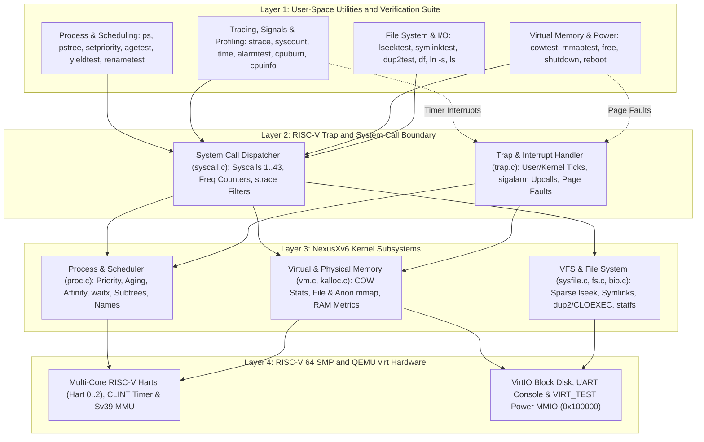
```mermaid
flowchart TD
    subgraph L1["Layer 1: User-Space Utilities and Verification Suite"]
        direction LR
        U_PROC["Process & Scheduling: ps, pstree, setpriority, agetest, yieldtest, renametest"]
        U_PROF["Tracing, Signals & Profiling: strace, syscount, time, alarmtest, cpuburn, cpuinfo"]
        U_MEM["Virtual Memory & Power: cowtest, mmaptest, free, shutdown, reboot"]
        U_FS["File System & I/O: lseektest, symlinktest, dup2test, df, ln -s, ls"]
    end

    subgraph L2["Layer 2: RISC-V Trap and System Call Boundary"]
        direction LR
        SYSC["System Call Dispatcher (syscall.c): Syscalls 1..43, Freq Counters, strace Filters"]
        TRAP["Trap & Interrupt Handler (trap.c): User/Kernel Ticks, sigalarm Upcalls, Page Faults"]
    end

    subgraph L3["Layer 3: NexusXv6 Kernel Subsystems"]
        direction LR
        K_PROC["Process & Scheduler (proc.c): Priority, Aging, Affinity, waitx, Subtrees, Names"]
        K_VM["Virtual & Physical Memory (vm.c, kalloc.c): COW Stats, File & Anon mmap, RAM Metrics"]
        K_FS["VFS & File System (sysfile.c, fs.c, bio.c): Sparse lseek, Symlinks, dup2/CLOEXEC, statfs"]
    end

    subgraph L4["Layer 4: RISC-V 64 SMP and QEMU virt Hardware"]
        direction LR
        HW_CPU["Multi-Core RISC-V Harts (Hart 0..2), CLINT Timer & Sv39 MMU"]
        HW_DEV["VirtIO Block Disk, UART Console & VIRT_TEST Power MMIO (0x100000)"]
    end

    U_PROC --> SYSC
    U_PROF --> SYSC
    U_MEM --> SYSC
    U_FS --> SYSC

    U_PROF -. "Timer Interrupts" .-> TRAP
    U_MEM -. "Page Faults" .-> TRAP

    SYSC --> K_PROC
    SYSC --> K_VM
    SYSC --> K_FS

    TRAP --> K_PROC
    TRAP --> K_VM

    K_PROC --> HW_CPU
    K_VM --> HW_CPU
    K_VM --> HW_DEV
    K_FS --> HW_DEV
```

---

# 1. Process Inspection — `ps`

The `ps()` system call (`SYS_ps = 23`) inspects all active slots in the kernel process table (`proc[NPROC]`) and prints a formatted summary directly to the console.

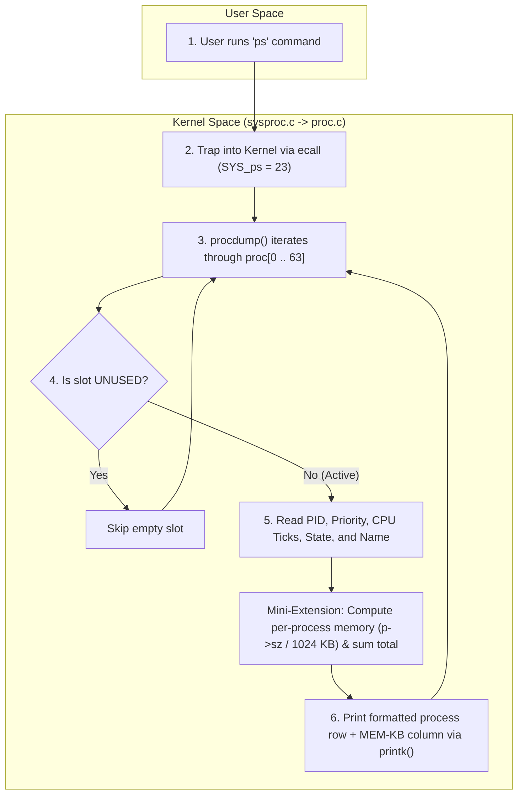
```mermaid
flowchart TD
    subgraph User["User Space"]
        U1["1. User runs 'ps' command"]
    end

    subgraph Kernel["Kernel Space (sysproc.c -> proc.c)"]
        K1["2. Trap into Kernel via ecall (SYS_ps = 23)"]
        K2["3. procdump() iterates through proc[0 .. 63]"]
        K3{"4. Is slot UNUSED?"}
        K4["Skip empty slot"]
        K5["5. Read PID, Priority, CPU Ticks, State, and Name"]
        K5M["Mini-Extension: Compute per-process memory (p->sz / 1024 KB) & sum total"]
        K6["6. Print formatted process row + MEM-KB column via printk()"]
    end

    U1 --> K1 --> K2 --> K3
    K3 -- "Yes" --> K4 --> K2
    K3 -- "No (Active)" --> K5 --> K5M --> K6 --> K2
```

### Displayed Information

```text
PID   PRIORITY   CPU-TICKS   MEM-KB   STATE     NAME
1     10         2           16       sleep     init
2     10         5           20       sleep     sh
3     10         0           16       run       ps
Total active process memory: 52 KB
```

### Mini-Extension: Per-Process Memory Usage (`MEM-KB`)

* Extends `procdump()` to inspect each active process's address-space size (`p->sz` in bytes) and convert it into kilobytes (`MEM-KB`) alongside a cumulative user-memory footer, making it easy to spot memory-heavy processes directly from `ps`.

### Relevant Files

* `kernel/syscall.h`, `kernel/syscall.c`, `kernel/sysproc.c`, `kernel/proc.c`, `user/ps.c`

---

# 2. Priority-Based CPU Scheduler — `setpriority`

NexusXv6 replaces plain round-robin selection with a **priority-aware scheduler** supporting levels `1` (highest priority) through `20` (lowest priority). New processes start at default priority `10`.

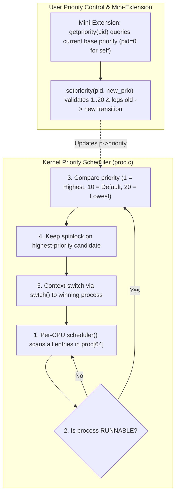
```mermaid
flowchart TD
    subgraph Config["User Priority Control & Mini-Extension"]
        P_GET["Mini-Extension: getpriority(pid) queries current base priority (pid=0 for self)"]
        P_SET["setpriority(pid, new_prio) validates 1..20 & logs old -> new transition"]
        P_GET --> P_SET
    end

    subgraph Sched["Kernel Priority Scheduler (proc.c)"]
        S1["1. Per-CPU scheduler() scans all entries in proc[64]"]
        S2{"2. Is process RUNNABLE?"}
        S3["3. Compare priority (1 = Highest, 10 = Default, 20 = Lowest)"]
        S4["4. Keep spinlock on highest-priority candidate"]
        S5["5. Context-switch via swtch() to winning process"]
    end

    P_SET -. "Updates p->priority" .-> S3
    S1 --> S2
    S2 -- "No" --> S1
    S2 -- "Yes" --> S3 --> S4 --> S5 --> S1
```

### Changing & Querying Priority

```text
$ setpriority 2 5
Process 2 priority changed: 10 -> 5
```

Values outside `1..20` are safely rejected with `-1` in `sys_setpriority()`.

### Mini-Extension: Priority Inspection (`getpriority`) & Self-Targeting (`pid = 0`)

* Adds a companion `getpriority(int pid)` system call and supports passing `pid = 0` in both `getpriority` and `setpriority` to inspect or adjust the calling process's own priority without needing `getpid()`, while reporting the previous priority before applying changes.

### Relevant Files

* `kernel/proc.h`, `kernel/proc.c`, `kernel/sysproc.c`, `user/setpriority.c`

---

# 3. Per-Process CPU-Time Accounting

Every process tracks its cumulative execution ticks in `p->cpu_time` (initialized to `0` in `allocproc()`). Whenever a hardware timer interrupt preempts a running process, its counter increases by `1`.

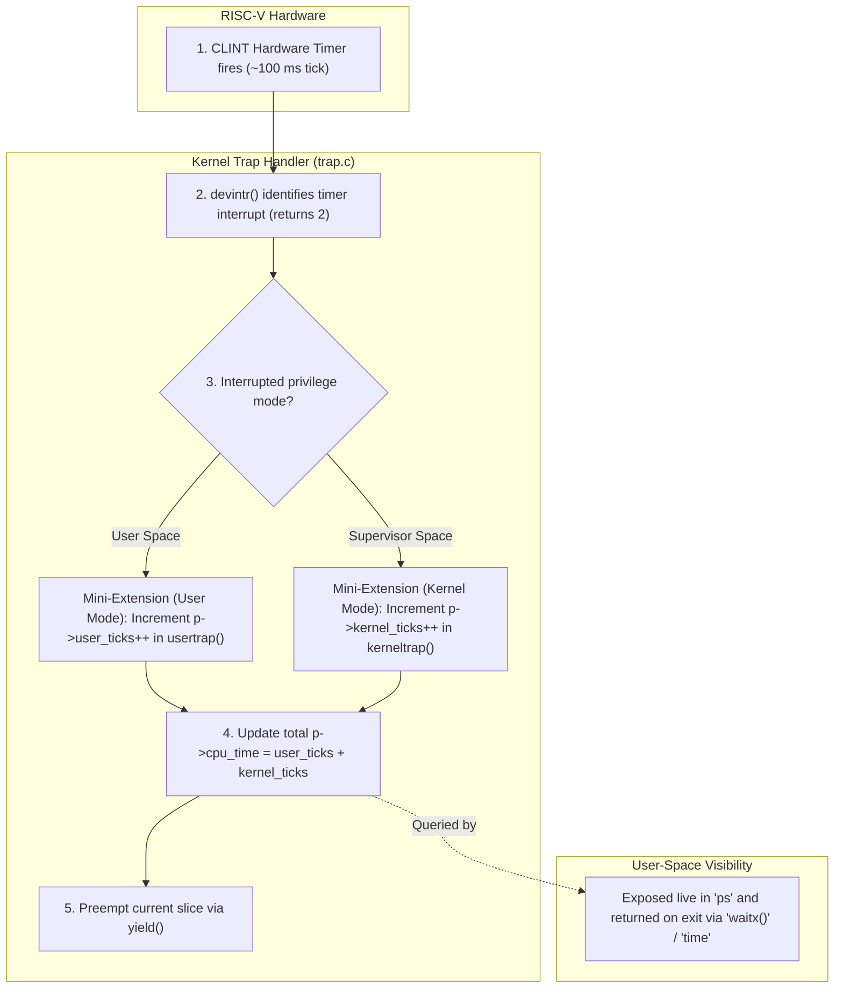
```mermaid
flowchart TD
    subgraph Hardware["RISC-V Hardware"]
        H1["1. CLINT Hardware Timer fires (~100 ms tick)"]
    end

    subgraph Kernel["Kernel Trap Handler (trap.c)"]
        T1["2. devintr() identifies timer interrupt (returns 2)"]
        T2{"3. Interrupted privilege mode?"}
        TU["Mini-Extension (User Mode): Increment p->user_ticks++ in usertrap()"]
        TK["Mini-Extension (Kernel Mode): Increment p->kernel_ticks++ in kerneltrap()"]
        T3["4. Update total p->cpu_time = user_ticks + kernel_ticks"]
        T4["5. Preempt current slice via yield()"]
    end

    subgraph Consumers["User-Space Visibility"]
        C1["Exposed live in 'ps' and returned on exit via 'waitx()' / 'time'"]
    end

    H1 --> T1 --> T2
    T2 -- "User Space" --> TU --> T3
    T2 -- "Supervisor Space" --> TK --> T3
    T3 --> T4
    T3 -. "Queried by" .-> C1
```

### Example

```text
$ cpuburn &
$ ps
PID   PRIORITY   CPU-TICKS (U/K)   STATE     NAME
4     10         84 (83/1)         runble    cpuburn
```

### Mini-Extension: User vs. Kernel CPU Tick Split (`user_ticks` / `kernel_ticks`)

* Splits CPU-time accounting into `p->user_ticks` (timer interrupts caught in `usertrap()`) and `p->kernel_ticks` (timer interrupts caught in `kerneltrap()`), distinguishing pure user computation from time spent inside system calls and I/O drivers.

### Relevant Files

* `kernel/proc.h`, `kernel/proc.c`, `kernel/trap.c`, `user/cpuburn.c`

---

# 4. Copy-on-Write (COW) Memory Management

During `fork()`, `uvmcopy()` avoids duplicating writable physical memory pages eagerly. Parent and child share the same physical frames marked read-only with `PTE_COW`, copying a page **only when either process writes to it**.

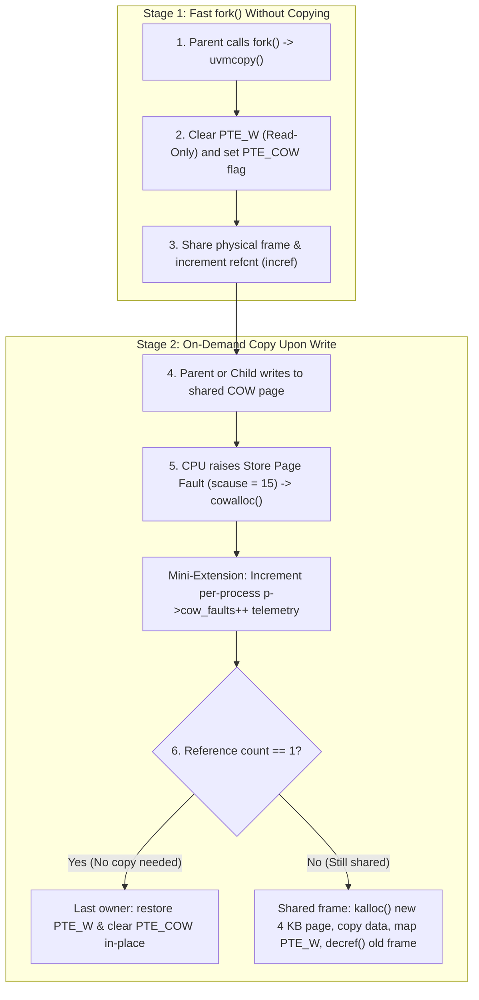
```mermaid
flowchart TD
    subgraph Phase1["Stage 1: Fast fork() Without Copying"]
        F1["1. Parent calls fork() -> uvmcopy()"]
        F2["2. Clear PTE_W (Read-Only) and set PTE_COW flag"]
        F3["3. Share physical frame & increment refcnt (incref)"]
        F1 --> F2 --> F3
    end

    subgraph Phase2["Stage 2: On-Demand Copy Upon Write"]
        W1["4. Parent or Child writes to shared COW page"]
        W2["5. CPU raises Store Page Fault (scause = 15) -> cowalloc()"]
        W3["Mini-Extension: Increment per-process p->cow_faults++ telemetry"]
        W4{"6. Reference count == 1?"}
        W5["Last owner: restore PTE_W & clear PTE_COW in-place"]
        W6["Shared frame: kalloc() new 4 KB page, copy data, map PTE_W, decref() old frame"]
        W1 --> W2 --> W3 --> W4
        W4 -- "Yes (No copy needed)" --> W5
        W4 -- "No (Still shared)" --> W6
    end

    F3 --> W1
```

### Key Mechanisms

* **Frame Reference Counting (`kernel/kalloc.c`):** `incref()`, `getref()`, and `decref()` ensure physical pages return to the free list only when their reference count drops to `0`.
* **Safe Kernel Writes (`copyout()`):** Detects `PTE_COW` destinations and resolves them via `cowalloc()` before writing kernel data into user memory.

### Mini-Extension: Per-Process COW Write-Fault Counter (`cow_faults`)

* Records `p->cow_faults` whenever `cowalloc()` resolves a write fault on a `PTE_COW` page, allowing `cowtest` and diagnostic tools to report exactly how many pages stayed shared after `fork()` versus how many required private allocation.

### Relevant Files

* `kernel/riscv.h`, `kernel/kalloc.c`, `kernel/vm.c`, `kernel/trap.c`, `user/cowtest.c`

---

# 5. Memory Mapping — `mmap()` and `munmap()`

NexusXv6 supports lazy, demand-paged virtual memory mappings using per-process Virtual Memory Areas (`struct vma vmas[16]`) with `PROT_READ`, `PROT_WRITE`, `MAP_SHARED`, and `MAP_PRIVATE`.

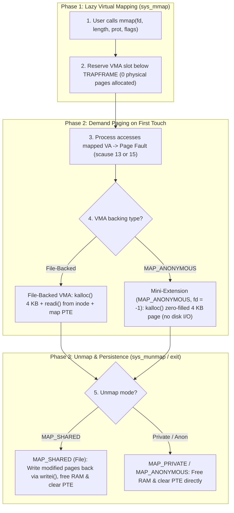
```mermaid
flowchart TD
    subgraph P1["Phase 1: Lazy Virtual Mapping (sys_mmap)"]
        M1["1. User calls mmap(fd, length, prot, flags)"]
        M2["2. Reserve VMA slot below TRAPFRAME (0 physical pages allocated)"]
        M1 --> M2
    end

    subgraph P2["Phase 2: Demand Paging on First Touch"]
        D1["3. Process accesses mapped VA -> Page Fault (scause 13 or 15)"]
        D2{"4. VMA backing type?"}
        D3["File-Backed VMA: kalloc() 4 KB + readi() from inode + map PTE"]
        D4["Mini-Extension (MAP_ANONYMOUS, fd = -1): kalloc() zero-filled 4 KB page (no disk I/O)"]
        D1 --> D2
        D2 -- "File-Backed" --> D3
        D2 -- "MAP_ANONYMOUS" --> D4
    end

    subgraph P3["Phase 3: Unmap & Persistence (sys_munmap / exit)"]
        U1{"5. Unmap mode?"}
        U2["MAP_SHARED (File): Write modified pages back via writei(), free RAM & clear PTE"]
        U3["MAP_PRIVATE / MAP_ANONYMOUS: Free RAM & clear PTE directly"]
        U1 -- "MAP_SHARED" --> U2
        U1 -- "Private / Anon" --> U3
    end

    M2 --> D1
    D3 --> U1
    D4 --> U1
```

### Mini-Extension: Anonymous Zero-Filled Mapping (`MAP_ANONYMOUS`)

* Adds the `MAP_ANONYMOUS` flag (`fd = -1`), enabling processes to allocate large, lazily demand-zeroed virtual memory regions without opening or creating a temporary backing file on disk.

### Relevant Files

* `kernel/param.h`, `kernel/proc.h`, `kernel/proc.c`, `kernel/sysproc.c`, `kernel/vm.c`, `kernel/trap.c`, `user/mmaptest.c`

---

# 6. System Call Tracing — `trace()` and `strace`

Processes can trace specific or all system calls at runtime via `trace(uint64 mask)` (`SYS_trace = 27`). Because `p->trace_mask` is copied during `fork()`, `strace` seamlessly traces child commands and pipelines.

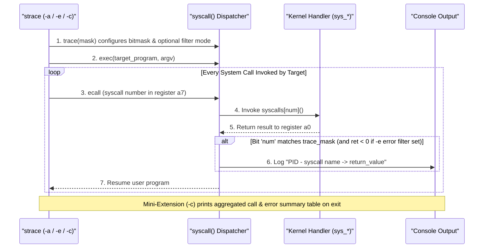
```mermaid
sequenceDiagram
    participant User as "strace (-a / -e / -c)"
    participant Disp as "syscall() Dispatcher"
    participant Hand as "Kernel Handler (sys_*)"
    participant Cons as "Console Output"

    User->>Disp: 1. trace(mask) configures bitmask & optional filter mode
    User->>Disp: 2. exec(target_program, argv)
    loop Every System Call Invoked by Target
        User->>Disp: 3. ecall (syscall number in register a7)
        Disp->>Hand: 4. Invoke syscalls[num]()
        Hand-->>Disp: 5. Return result to register a0
        alt Bit 'num' matches trace_mask (and ret < 0 if -e error filter set)
            Disp->>Cons: 6. Log "PID - syscall name -> return_value"
        end
        Disp-->>User: 7. Resume user program
    end
    Note over User,Cons: Mini-Extension (-c) prints aggregated call & error summary table on exit
```

### Example

```text
$ strace -a echo hello
4: syscall exec -> 2
hello
4: syscall write -> 5
4: syscall write -> 1
```

### Mini-Extension: Failure-Only Filter (`strace -e`) & Summary Mode (`strace -c`)

* Adds `-e` to log **only failing system calls** (`return_value < 0`) for rapid debugging, and `-c` to print a clean post-execution summary table showing call counts and failure totals per system call.

### Relevant Files

* `kernel/proc.h`, `kernel/proc.c`, `kernel/syscall.h`, `kernel/syscall.c`, `kernel/sysproc.c`, `user/strace.c`

---

# 7. System Resource Diagnostics — `sysinfo()` and `free`

The `sysinfo(struct sysinfo *)` system call (`SYS_sysinfo = 28`) gathers live physical memory, process table, and uptime metrics from across the kernel into a single user-space snapshot.

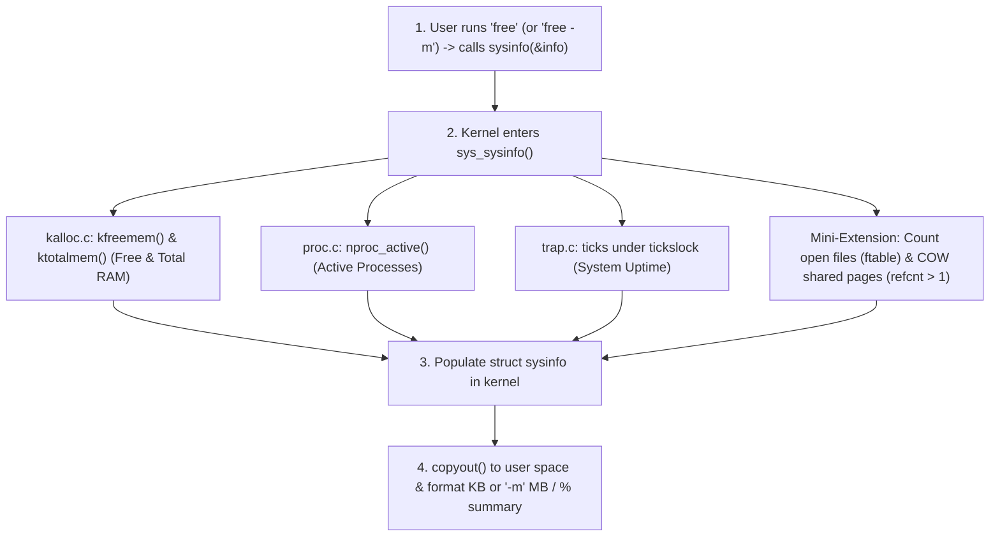
```mermaid
flowchart TD
    U["1. User runs 'free' (or 'free -m') -> calls sysinfo(&info)"] --> S["2. Kernel enters sys_sysinfo()"]

    S --> M["kalloc.c: kfreemem() & ktotalmem() (Free & Total RAM)"]
    S --> P["proc.c: nproc_active() (Active Processes)"]
    S --> T["trap.c: ticks under tickslock (System Uptime)"]
    S --> EXT["Mini-Extension: Count open files (ftable) & COW shared pages (refcnt > 1)"]

    M --> Pack["3. Populate struct sysinfo in kernel"]
    P --> Pack
    T --> Pack
    EXT --> Pack

    Pack --> Out["4. copyout() to user space & format KB or '-m' MB / % summary"]
```

### Example

```text
$ free -m
Total memory:  127 MB (32735 pages)
Used memory:   1 MB   (81 pages, <1%)
Free memory:   126 MB (32654 pages)
Shared COW:    14 pages | Open files: 3 / 100
Active procs:  3 / 64   | Uptime: 42 ticks
```

### Mini-Extension: Megabyte Formatting (`free -m`) & Kernel Table Metrics

* Extends `struct sysinfo` with system-wide active open file descriptors (`nfiles` from `ftable`) and shared Copy-on-Write frames (`shared_pages`), while adding `free -m` to display memory in megabytes with utilization percentages.

### Relevant Files

* `kernel/sysinfo.h`, `kernel/kalloc.c`, `kernel/proc.c`, `kernel/sysproc.c`, `user/free.c`

---

# 8. Parent Process Inspection — `getppid()` and `pstree`

NexusXv6 adds `getppid()` (`SYS_getppid = 29`) to query the caller's parent PID safely under `wait_lock`, and `ptree()` (`SYS_ptree = 30`) to snapshot the process table and render the live parent-child process tree.

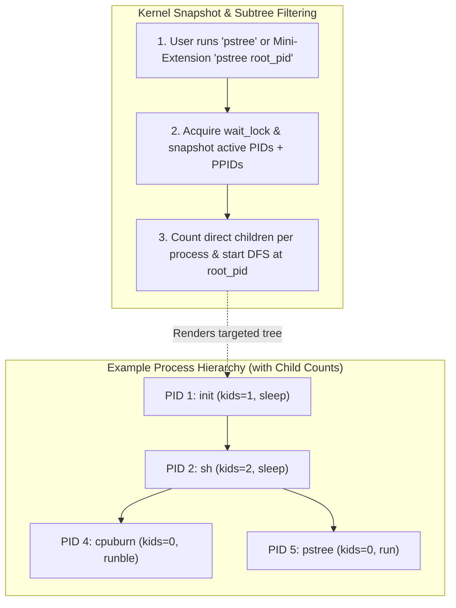
```mermaid
flowchart TD
    subgraph Flow["Kernel Snapshot & Subtree Filtering"]
        A["1. User runs 'pstree' or Mini-Extension 'pstree root_pid'"] --> B["2. Acquire wait_lock & snapshot active PIDs + PPIDs"]
        B --> C["3. Count direct children per process & start DFS at root_pid"]
    end

    subgraph Tree["Example Process Hierarchy (with Child Counts)"]
        P1["PID 1: init (kids=1, sleep)"] --> P2["PID 2: sh (kids=2, sleep)"]
        P2 --> P4["PID 4: cpuburn (kids=0, runble)"]
        P2 --> P5["PID 5: pstree (kids=0, run)"]
    end

    C -. "Renders targeted tree" .-> P1
```

### Example

```text
$ pstree 2
Subtree Root PID: 2 (children=2)
[2] sh (prio=10, state=sleep, kids=2)
  |-- [4] cpuburn (prio=10, state=runble, kids=0)
  |-- [5] pstree (prio=10, state=run, kids=0)
```

### Mini-Extension: Targeted Subtree Root (`pstree <pid>`) & Child Count Badge

* Allows passing an optional `root_pid` argument (`pstree 2`) so `ptree()` renders only the descendant hierarchy beneath a chosen parent process and annotates each node with its active child count (`kids=N`).

### Relevant Files

* `kernel/proc.c`, `kernel/sysproc.c`, `kernel/syscall.h`, `user/pstree.c`

---

# 9. Priority Aging for Starvation Prevention

Pure static priority scheduling can starve low-priority (`priority = 20`) processes when high-priority CPU-bound tasks stay runnable. NexusXv6 prevents starvation through **dynamic priority aging** inside `scheduler()`.

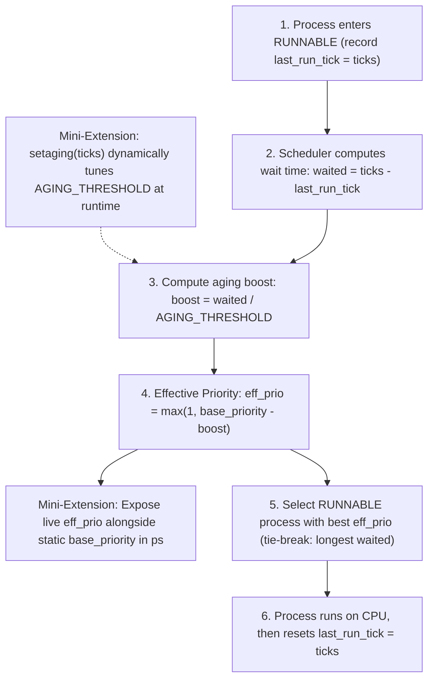
```mermaid
flowchart TD
    CFG["Mini-Extension: setaging(ticks) dynamically tunes AGING_THRESHOLD at runtime"] -.-> C
    A["1. Process enters RUNNABLE (record last_run_tick = ticks)"] --> B["2. Scheduler computes wait time: waited = ticks - last_run_tick"]
    B --> C["3. Compute aging boost: boost = waited / AGING_THRESHOLD"]
    C --> D["4. Effective Priority: eff_prio = max(1, base_priority - boost)"]
    D --> EXP["Mini-Extension: Expose live eff_prio alongside static base_priority in ps"]
    D --> E["5. Select RUNNABLE process with best eff_prio (tie-break: longest waited)"]
    E --> F["6. Process runs on CPU, then resets last_run_tick = ticks"]
```

### Key Properties

* **Base priority preserved:** `p->priority` remains unchanged while `eff_prio` temporarily improves the longer a runnable task waits.
* **Verified under SMP saturation:** `agetest` pins all CPU cores with `priority = 3` hogs and confirms a `priority = 20` worker still completes promptly.

### Mini-Extension: Live `EFF-PRIO` Visibility & Runtime Aging Tuning (`setaging`)

* Exposes each runnable process's dynamically boosted `eff_prio` next to its static `base_priority` for live inspection, and adds `setaging(int ticks)` so evaluators can adjust `AGING_THRESHOLD` on the fly without recompiling the kernel.

### Relevant Files

* `kernel/param.h`, `kernel/proc.h`, `kernel/proc.c`, `user/agetest.c`

---

# 10. Per-Process System Call Accounting — `getsyscallcount()`

Every valid system call increments `p->syscall_count` in `syscall()`. User programs can inspect their own count (`getsyscallcount(0)`) or query any active PID (`getsyscallcount(pid)`, `SYS_getsyscallcount = 31`).

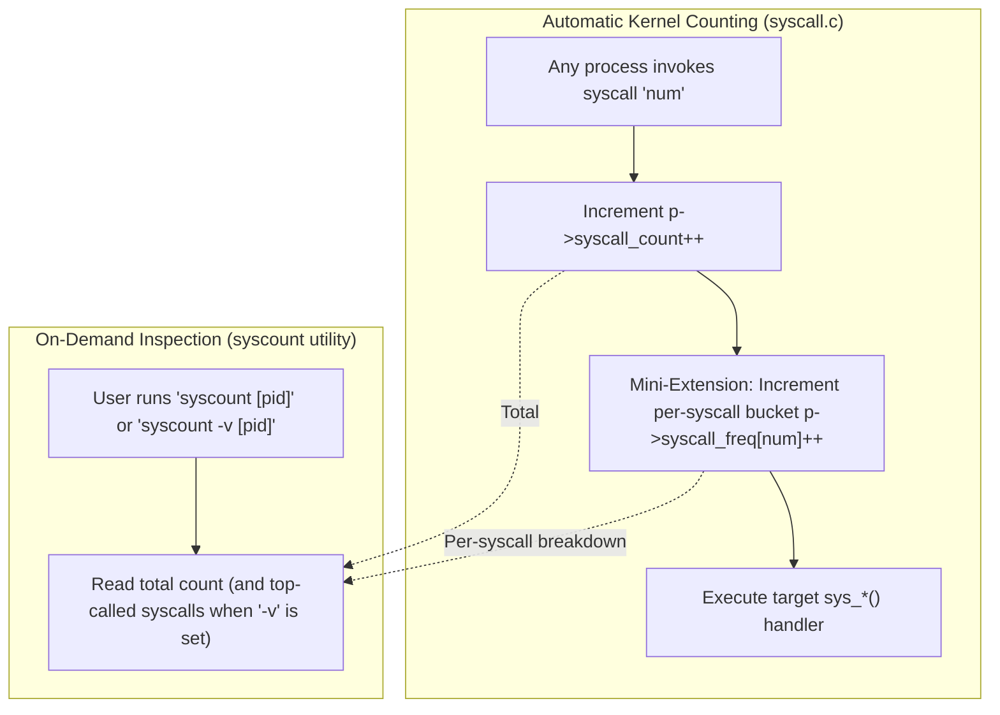
```mermaid
flowchart TD
    subgraph Track["Automatic Kernel Counting (syscall.c)"]
        S1["Any process invokes syscall 'num'"] --> S2["Increment p->syscall_count++"]
        S2 --> S2M["Mini-Extension: Increment per-syscall bucket p->syscall_freq[num]++"]
        S2M --> S3["Execute target sys_*() handler"]
    end

    subgraph Query["On-Demand Inspection (syscount utility)"]
        Q1["User runs 'syscount [pid]' or 'syscount -v [pid]'"] --> Q2["Read total count (and top-called syscalls when '-v' is set)"]
    end

    S2 -. "Total" .-> Q2
    S2M -. "Per-syscall breakdown" .-> Q2
```

### Example

```text
$ syscount -v 2
Process 2 total syscalls: 28
Top syscalls: read (14), write (8), fork (3), wait (3)
```

### Mini-Extension: Per-Syscall Frequency Breakdown (`syscount -v`)

* Maintains a lightweight per-process array `p->syscall_freq[44]` in `struct proc`, enabling `syscount -v [pid]` to display not just the grand total, but also the top/most frequently invoked system calls by name.

### Relevant Files

* `kernel/proc.h`, `kernel/proc.c`, `kernel/syscall.c`, `kernel/sysproc.c`, `user/syscount.c`

---

# 11. Process Execution Benchmarking — `waitx()` and `time`

Each process records its creation tick (`p->ctime = ticks`) in `allocproc()`. The `waitx(&status, &wtime, &rtime)` system call (`SYS_waitx = 32`) reaps an exited child and reports both **CPU execution ticks (`rtime`)** and **waiting/sleeping ticks (`wtime`)**.

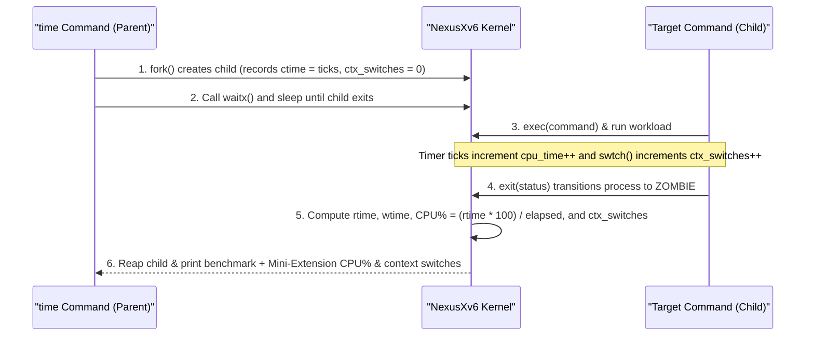
```mermaid
sequenceDiagram
    participant Time as "time Command (Parent)"
    participant Kern as "NexusXv6 Kernel"
    participant Child as "Target Command (Child)"

    Time->>Kern: 1. fork() creates child (records ctime = ticks, ctx_switches = 0)
    Time->>Kern: 2. Call waitx() and sleep until child exits
    Child->>Kern: 3. exec(command) & run workload
    Note over Kern,Child: Timer ticks increment cpu_time++ and swtch() increments ctx_switches++
    Child->>Kern: 4. exit(status) transitions process to ZOMBIE
    Kern->>Kern: 5. Compute rtime, wtime, CPU% = (rtime * 100) / elapsed, and ctx_switches
    Kern-->>Time: 6. Reap child & print benchmark + Mini-Extension CPU% & context switches
```

### Example

```text
$ time cowtest
Original: A
After child 1: A
After child 2: A
--- Benchmark: cowtest (PID 6) ---
Elapsed ticks:    4
CPU ticks:        3 (75% CPU)
Wait ticks:       1
Context switches: 5
Exit status:      0
```

### Mini-Extension: CPU Utilization Percentage (`CPU%`) & Context-Switch Count

* Increments `p->ctx_switches` whenever `scheduler()` dispatches the process and computes **CPU utilization percentage** (`(rtime * 100) / elapsed_ticks`) in `time`, revealing whether a workload is CPU-bound or I/O-bound.

### Relevant Files

* `kernel/proc.h`, `kernel/proc.c`, `kernel/sysproc.c`, `user/time.c`

---

# 12. Clean System Power Management — `halt()` and `reboot()`

NexusXv6 maps QEMU's SiFive test/power finisher device (`VIRT_TEST = 0x100000L`) into the kernel page table during `kvmmake()`. The `shutdown` and `reboot` commands flush disk buffers first via `sync()`, then signal QEMU cleanly via MMIO.

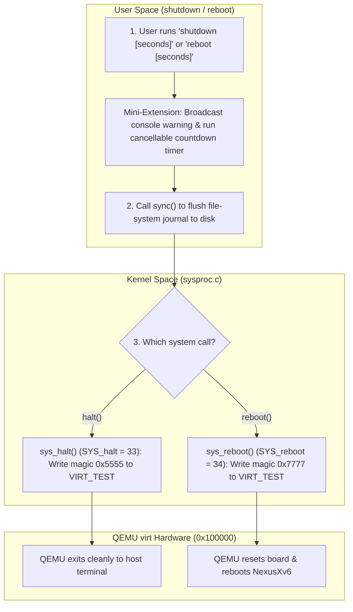
```mermaid
flowchart TD
    subgraph User["User Space (shutdown / reboot)"]
        U1["1. User runs 'shutdown [seconds]' or 'reboot [seconds]'"]
        UM["Mini-Extension: Broadcast console warning & run cancellable countdown timer"]
        U2["2. Call sync() to flush file-system journal to disk"]
        U1 --> UM --> U2
    end

    subgraph Kernel["Kernel Space (sysproc.c)"]
        K1{"3. Which system call?"}
        K2["sys_halt() (SYS_halt = 33): Write magic 0x5555 to VIRT_TEST"]
        K3["sys_reboot() (SYS_reboot = 34): Write magic 0x7777 to VIRT_TEST"]
        K1 -- "halt()" --> K2
        K1 -- "reboot()" --> K3
    end

    subgraph QEMU["QEMU virt Hardware (0x100000)"]
        Q1["QEMU exits cleanly to host terminal"]
        Q2["QEMU resets board & reboots NexusXv6"]
    end

    U2 --> K1
    K2 --> Q1
    K3 --> Q2
```

### Example

```text
$ shutdown 3
Broadcast: NexusXv6 shutting down in 3 seconds... (3... 2... 1...)
Flushing filesystems...
System halting...
```

### Mini-Extension: Timed Countdown & Broadcast Warning (`shutdown <sec>`)

* Supports an optional delay argument (`shutdown 5` or `reboot 3`) that broadcasts a console countdown warning, gives background jobs time to finish (or allows aborting before zero), flushes the disk log, and triggers clean MMIO power control.

### Relevant Files

* `kernel/memlayout.h`, `kernel/vm.c`, `kernel/sysproc.c`, `user/shutdown.c`, `user/reboot.c`

---

# 13. Voluntary CPU Yielding — `sched_yield()`

The `sched_yield()` system call (`SYS_sched_yield = 35`) exposes cooperative scheduling to user space, allowing threads/workers to give up the remainder of their CPU time slice immediately without waiting for a hardware timer interrupt.

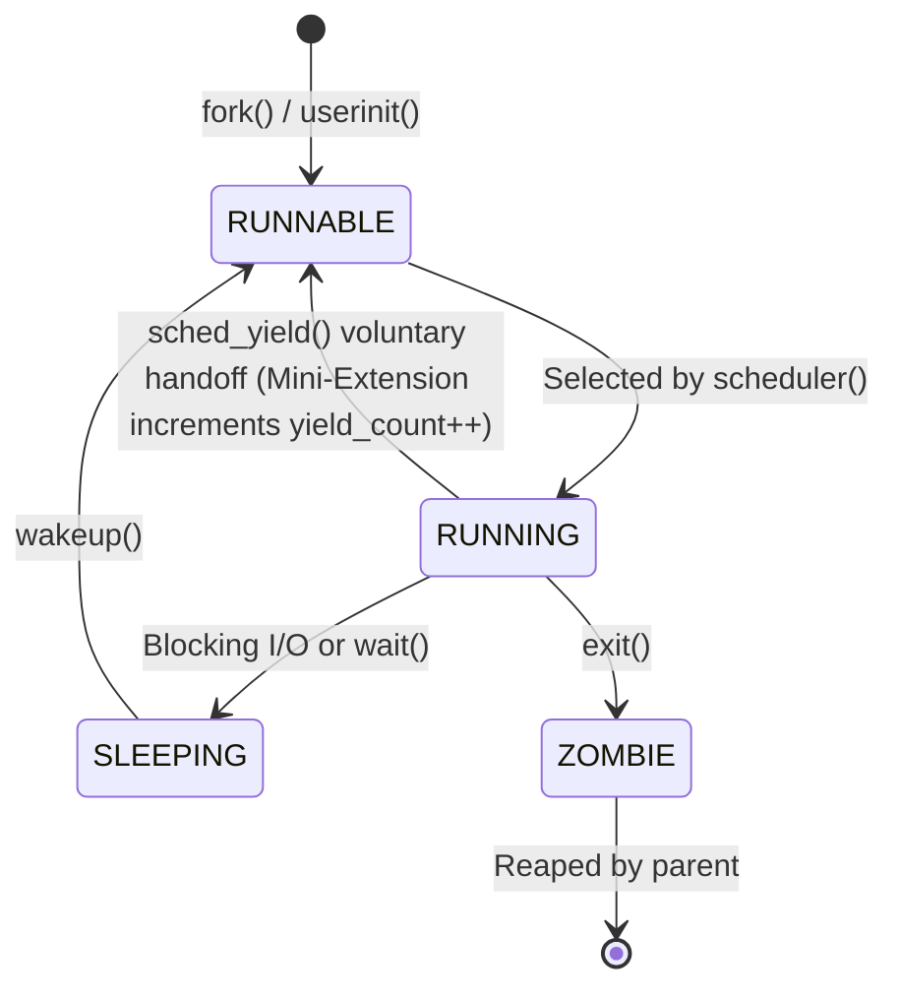
```mermaid
stateDiagram-v2
    [*] --> RUNNABLE : fork() / userinit()
    RUNNABLE --> RUNNING : Selected by scheduler()
    RUNNING --> RUNNABLE : sched_yield() voluntary handoff (Mini-Extension increments yield_count++)
    RUNNING --> SLEEPING : Blocking I/O or wait()
    SLEEPING --> RUNNABLE : wakeup()
    RUNNING --> ZOMBIE : exit()
    ZOMBIE --> [*] : Reaped by parent
```

### Example

```text
$ yieldtest
yieldtest: starting cooperative CPU yield test
Worker A (PID 4): step 1 -> sched_yield() (voluntary yields = 1)
Worker B (PID 5): step 1 -> sched_yield() (voluntary yields = 1)
...
yieldtest: ALL TESTS PASSED (6 total voluntary yields verified)
```

### Mini-Extension: Per-Process Voluntary Yield Counter (`yield_count`)

* Tracks `p->yield_count` in `struct proc` (incremented on each `sys_sched_yield()` call and returned to the caller), enabling cooperative benchmarks to verify exact voluntary handoffs versus timer-driven involuntary preemptions.

### Relevant Files

* `kernel/sysproc.c`, `kernel/proc.c`, `user/yieldtest.c`

---

# 14. Multi-Core HART Identification — `getcpuid()`

QEMU boots NexusXv6 as a symmetric multiprocessor (`CPUS = 3`: `hart 0`, `hart 1`, `hart 2`). The `getcpuid()` system call (`SYS_getcpuid = 36`) safely returns which physical RISC-V hardware thread is currently executing the calling process.

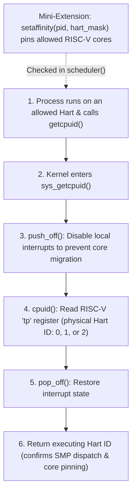
```mermaid
flowchart TD
    AFF["Mini-Extension: setaffinity(pid, hart_mask) pins allowed RISC-V cores"] -. "Checked in scheduler()" .-> U
    U["1. Process runs on an allowed Hart & calls getcpuid()"] --> K1["2. Kernel enters sys_getcpuid()"]
    K1 --> K2["3. push_off(): Disable local interrupts to prevent core migration"]
    K2 --> K3["4. cpuid(): Read RISC-V 'tp' register (physical Hart ID: 0, 1, or 2)"]
    K3 --> K4["5. pop_off(): Restore interrupt state"]
    K4 --> U2["6. Return executing Hart ID (confirms SMP dispatch & core pinning)"]
```

### Example

```text
$ cpuinfo
Parent (PID 4) running on RISC-V hart 0
Pinned Worker (mask=0x4 -> hart 2 only) executing on RISC-V hart 2
```

### Mini-Extension: Soft CPU Core Affinity Mask (`setaffinity`)

* Adds a per-process `p->cpu_affinity` bitmask (default `0x7` for harts `0..2`) checked by `scheduler()` before context-switching, allowing latency-sensitive workers to pin themselves to specific RISC-V cores and verify placement with `getcpuid()`.

### Relevant Files

* `kernel/sysproc.c`, `kernel/proc.c`, `user/cpuinfo.c`

---

# 15. Dynamic Process Naming — `setprocname()`

The `setprocname(const char *name)` system call (`SYS_setprocname = 37`) allows worker processes and background services to assign themselves meaningful runtime names (up to 15 characters + NUL) visible in `ps` and `pstree`.

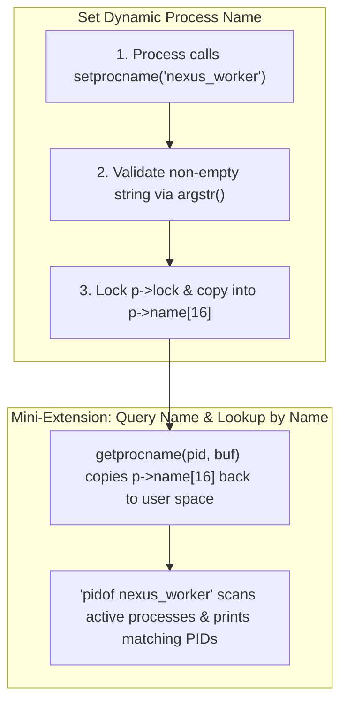
```mermaid
flowchart TD
    subgraph Write["Set Dynamic Process Name"]
        U["1. Process calls setprocname('nexus_worker')"] --> K1["2. Validate non-empty string via argstr()"]
        K1 --> K2["3. Lock p->lock & copy into p->name[16]"]
    end

    subgraph Read["Mini-Extension: Query Name & Lookup by Name"]
        R1["getprocname(pid, buf) copies p->name[16] back to user space"]
        R2["'pidof nexus_worker' scans active processes & prints matching PIDs"]
    end

    K2 --> R1 --> R2
```

### Example

```text
$ renametest
renametest (PID 5): renamed to "nexus_worker"
getprocname(5) -> "nexus_worker"
renametest: ALL TESTS PASSED
```

### Mini-Extension: Name Retrieval (`getprocname`) & `pidof` Utility

* Adds `getprocname(int pid, char *buf)` to read back any active process's runtime name into user space and powers a `pidof <name>` command to locate daemon/worker PIDs by name.

### Relevant Files

* `kernel/sysproc.c`, `kernel/proc.h`, `user/renametest.c`

---

# 16. Random-Access File Positioning — `lseek()`

Baseline xv6 only supports sequential file reads and writes. NexusXv6 adds `lseek(int fd, int offset, int whence)` (`SYS_lseek = 38`), enabling random-access file positioning with `SEEK_SET` (`0`), `SEEK_CUR` (`1`), and `SEEK_END` (`2`).

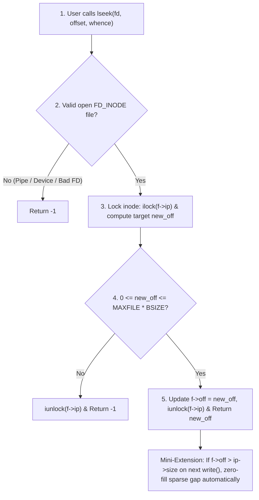
```mermaid
flowchart TD
    U["1. User calls lseek(fd, offset, whence)"] --> V{"2. Valid open FD_INODE file?"}
    V -- "No (Pipe / Device / Bad FD)" --> E1["Return -1"]
    V -- "Yes" --> L["3. Lock inode: ilock(f->ip) & compute target new_off"]
    L --> B{"4. 0 <= new_off <= MAXFILE * BSIZE?"}
    B -- "No" --> E2["iunlock(f->ip) & Return -1"]
    B -- "Yes" --> OK["5. Update f->off = new_off, iunlock(f->ip) & Return new_off"]
    OK --> SP["Mini-Extension: If f->off > ip->size on next write(), zero-fill sparse gap automatically"]
```

### Example

```text
$ lseektest
lseektest: starting random-access file positioning test
lseektest: SEEK_SET offset 4 -> patched 4 bytes
lseektest: SEEK_CUR offset 10 -> read "ABCD"
lseektest: SEEK_END -12 -> verified "WXYZ" (size=16)
lseektest: ALL TESTS PASSED
```

### Mini-Extension: Sparse Seek Past EOF with Automatic Zero-Fill

* Extends `filewrite()` so that when a process seeks beyond the current end-of-file (`lseek(fd, 512, SEEK_END)`) and writes new bytes, the kernel automatically zero-fills the intermediate hole between old `ip->size` and `f->off`.

### Relevant Files

* `kernel/fcntl.h`, `kernel/syscall.h`, `kernel/syscall.c`, `kernel/sysfile.c`, `user/lseektest.c`

---

# 17. Symbolic Links — `symlink()` and `O_NOFOLLOW`

NexusXv6 introduces symbolic-link inodes (`T_SYMLINK = 4`) via `symlink(const char *target, const char *path)` (`SYS_symlink = 39`), shell support in `ln -s`, `ls` type recognition, `O_NOFOLLOW` raw inspection, and bounded cycle detection (`MAXSYMLINK = 10`).

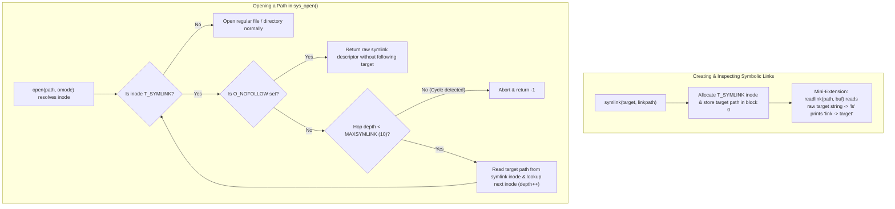
```mermaid
flowchart TD
    subgraph Create["Creating & Inspecting Symbolic Links"]
        C1["symlink(target, linkpath)"] --> C2["Allocate T_SYMLINK inode & store target path in block 0"]
        C2 --> RL["Mini-Extension: readlink(path, buf) reads raw target string -> 'ls' prints 'link -> target'"]
    end

    subgraph Open["Opening a Path in sys_open()"]
        O1["open(path, omode) resolves inode"] --> O2{"Is inode T_SYMLINK?"}
        O2 -- "No" --> O6["Open regular file / directory normally"]
        O2 -- "Yes" --> O3{"Is O_NOFOLLOW set?"}
        O3 -- "Yes" --> O4["Return raw symlink descriptor without following target"]
        O3 -- "No" --> O5{"Hop depth < MAXSYMLINK (10)?"}
        O5 -- "No (Cycle detected)" --> ERR["Abort & return -1"]
        O5 -- "Yes" --> HOP["Read target path from symlink inode & lookup next inode (depth++)"]
        HOP --> O2
    end
```

### Example

```text
$ ln -s README doclink
$ ls doclink
doclink -> README   4 45 7
```

### Mini-Extension: `readlink()` Syscall & Target Arrow Display in `ls`

* Adds `readlink(const char *path, char *buf, int bufsiz)` to fetch the target string directly from a `T_SYMLINK` inode without opening a file descriptor, enabling `ls` to display symbolic links cleanly as `doclink -> README`.

### Relevant Files

* `kernel/stat.h`, `kernel/fcntl.h`, `kernel/param.h`, `kernel/sysfile.c`, `user/ln.c`, `user/ls.c`, `user/symlinktest.c`

---

# 18. Periodic User-Space Timer Alarms — `sigalarm()` and `sigreturn()`

NexusXv6 supports kernel-to-user timer upcalls via `sigalarm(int ticks, void (*handler)(void))` (`SYS_sigalarm = 40`) and `sigreturn()` (`SYS_sigreturn = 41`). The kernel preserves interrupted user registers in `p->alarm_tf` and prevents re-entrant signal overlap via `p->alarm_active`.

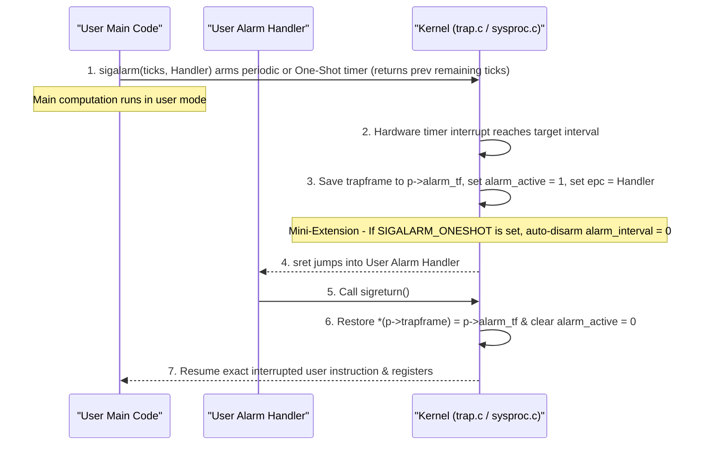
```mermaid
sequenceDiagram
    participant App as "User Main Code"
    participant Handler as "User Alarm Handler"
    participant Kernel as "Kernel (trap.c / sysproc.c)"

    App->>Kernel: 1. sigalarm(ticks, Handler) arms periodic or One-Shot timer (returns prev remaining ticks)
    Note over App: Main computation runs in user mode
    Kernel->>Kernel: 2. Hardware timer interrupt reaches target interval
    Kernel->>Kernel: 3. Save trapframe to p->alarm_tf, set alarm_active = 1, set epc = Handler
    Note over Kernel: Mini-Extension - If SIGALARM_ONESHOT is set, auto-disarm alarm_interval = 0
    Kernel-->>Handler: 4. sret jumps into User Alarm Handler
    Handler->>Kernel: 5. Call sigreturn()
    Kernel->>Kernel: 6. Restore *(p->trapframe) = p->alarm_tf & clear alarm_active = 0
    Kernel-->>App: 7. Resume exact interrupted user instruction & registers
```

### Example

```text
$ alarmtest
alarmtest: configuring periodic timer (interval = 2 ticks)
alarmtest: timer signal #1 delivered to user handler
...
alarmtest: register state verified across 4 signals
alarmtest: ALL TESTS PASSED
```

### Mini-Extension: One-Shot Alarm Mode (`SIGALARM_ONESHOT`) & Remaining-Ticks Return

* Allows arming single-shot timeout callbacks that automatically disarm after firing once, and updates `sigalarm()` to return the number of ticks remaining from any previously scheduled alarm (mirroring POSIX `alarm()`).

### Relevant Files

* `kernel/proc.h`, `kernel/proc.c`, `kernel/exec.c`, `kernel/trap.c`, `kernel/sysproc.c`, `user/alarmtest.c`

---

# 19. Targeted File Descriptor Redirection — `dup2()`

While baseline `dup()` only allocates the lowest free descriptor slot, `dup2(int oldfd, int newfd)` (`SYS_dup2 = 42`) atomically duplicates `oldfd` onto an exact target slot `newfd`, closing any previously open file at `newfd` first.

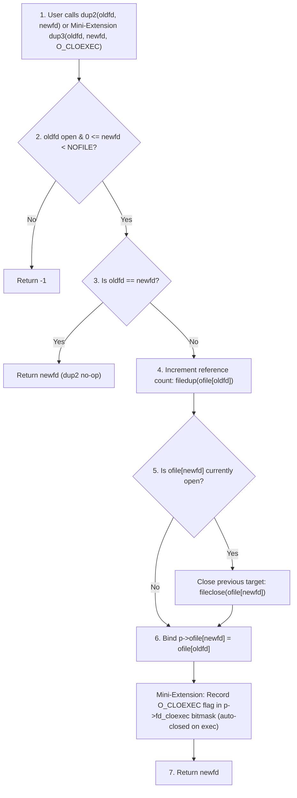
```mermaid
flowchart TD
    A["1. User calls dup2(oldfd, newfd) or Mini-Extension dup3(oldfd, newfd, O_CLOEXEC)"] --> B{"2. oldfd open & 0 <= newfd < NOFILE?"}
    B -- "No" --> ERR["Return -1"]
    B -- "Yes" --> C{"3. Is oldfd == newfd?"}
    C -- "Yes" --> RET["Return newfd (dup2 no-op)"]
    C -- "No" --> D["4. Increment reference count: filedup(ofile[oldfd])"]
    D --> E{"5. Is ofile[newfd] currently open?"}
    E -- "Yes" --> F["Close previous target: fileclose(ofile[newfd])"]
    E -- "No" --> G["6. Bind p->ofile[newfd] = ofile[oldfd]"]
    F --> G
    G --> CLO["Mini-Extension: Record O_CLOEXEC flag in p->fd_cloexec bitmask (auto-closed on exec)"]
    CLO --> RET2["7. Return newfd"]
```

### Example

```text
$ dup2test
dup2test: starting targeted descriptor redirection test
dup2test: shared offset across fd 3 and fd 10 OK
dup2test: ALL TESTS PASSED
```

### Mini-Extension: Close-on-Exec Descriptor Flag (`dup3` / `O_CLOEXEC`)

* Adds a per-process `p->fd_cloexec` bitmask and `dup3(oldfd, newfd, flags)` support so descriptors marked with `O_CLOEXEC` are automatically closed during `kexec()`, preventing private parent file descriptors from leaking into executed child programs.

### Relevant Files

* `kernel/syscall.h`, `kernel/syscall.c`, `kernel/sysfile.c`, `user/dup2test.c`

---

# 20. File System & Disk Usage Diagnostics — `statfs()` and `df`

Complementing `free` for physical memory, `statfs(struct statfs *)` (`SYS_statfs = 43`) and the `df` command inspect live on-disk storage utilization across the VirtIO block filesystem via the kernel buffer cache.

```mermaid
flowchart TD
    U["1. User runs 'df', 'df -t', or Mini-Extension 'df -c'"] --> K["2. Kernel enters sys_statfs() -> fsstat()"]

    K --> SB["Read Superblock (sb): block size, total blocks, data & log counts"]
    K --> BM["Scan Block Bitmap via bread(): count allocated vs. free disk blocks"]
    K --> IN["Scan On-Disk Inode Blocks (IBLOCK): count active vs. free inodes"]
    K --> BC["Mini-Extension (bio.c): Read buffer-cache bcache_hits & bcache_misses"]

    SB --> PACK["3. Populate struct statfs"]
    BM --> PACK
    IN --> PACK
    BC --> PACK

    PACK --> OUT["4. copyout() to user space & display disk, inode, and cache hit-rate report"]
```

### Example

```text
$ df -c
Filesystem (ROOTDEV 1, block size 1024 B):
Total disk:   4000 KB (4000 blocks, 3953 data, 31 log)
Used disk:    1792 KB (1792 blocks, 44%)
Free disk:    2208 KB (2208 blocks)
Inodes:       44 used / 199 total (155 free)
Buffer cache: 412 hits / 18 misses (95% hit rate)
```

### Mini-Extension: Buffer Cache Hit/Miss Telemetry (`df -c`)

* Tracks cache hits (block already resident in `bcache`) versus disk misses (`virtio_disk_rw` reads) inside `bget()` (`kernel/bio.c`), allowing `df -c` to report live LRU buffer-cache efficiency alongside disk and inode capacity.

### Relevant Files

* `kernel/statfs.h`, `kernel/defs.h`, `kernel/fs.c`, `kernel/bio.c`, `kernel/sysfile.c`, `user/df.c`

---

# System Calls Added (23 – 43)

| System Call         | Number | Module | Purpose                                                |
| ------------------- | -----: | -----: | ------------------------------------------------------ |
| `ps()`              |     23 |      1 | Display active entries in the kernel process table     |
| `setpriority()`     |     24 |      2 | Change process scheduling priority (`1..20`)           |
| `mmap()`            |     25 |      5 | Create a lazy file-backed virtual memory mapping       |
| `munmap()`          |     26 |      5 | Unmap pages and write back `MAP_SHARED` modifications  |
| `trace()`           |     27 |      6 | Configure per-process system-call trace bitmask        |
| `sysinfo()`         |     28 |      7 | Query free/total RAM, active processes, and uptime     |
| `getppid()`         |     29 |      8 | Return calling process's parent PID                    |
| `ptree()`           |     30 |      8 | Display hierarchical parent-child process tree         |
| `getsyscallcount()` |     31 |     10 | Return per-process invoked system-call count           |
| `waitx()`           |     32 |     11 | Reap child and return wait ticks & active CPU ticks    |
| `halt()`            |     33 |     12 | Cleanly power off the QEMU RISC-V virtual machine      |
| `reboot()`          |     34 |     12 | Cleanly restart the QEMU RISC-V virtual machine        |
| `sched_yield()`     |     35 |     13 | Voluntarily yield the current CPU time slice           |
| `getcpuid()`        |     36 |     14 | Return executing RISC-V hardware thread (hart) ID      |
| `setprocname()`     |     37 |     15 | Dynamically update the calling process's name          |
| `lseek()`           |     38 |     16 | Reposition read/write file offset (`SEEK_SET/CUR/END`) |
| `symlink()`         |     39 |     17 | Create a symbolic link (`T_SYMLINK`) to a target path  |
| `sigalarm()`        |     40 |     18 | Register a periodic user-space timer alarm callback    |
| `sigreturn()`       |     41 |     18 | Restore saved trapframe after user alarm handler runs  |
| `dup2()`            |     42 |     19 | Atomically duplicate a file descriptor onto `newfd`    |
| `statfs()`          |     43 |     20 | Query disk block, log, and inode usage statistics      |

---

# Building & Running

NexusXv6 builds and runs on **WSL2 (Ubuntu)** with `build-essential`, `gcc-riscv64-unknown-elf`, `qemu-system-misc` / `qemu-system-riscv`, `perl`, and `bc`:

```bash
cd /mnt/d/xv6-riscv-riscv
make clean
make
make qemu
```

Inside the NexusXv6 shell (`$`):

```text
$ ps
$ pstree
$ free
$ df -t
$ setpriority 2 5
$ agetest
$ cowtest
$ mmaptest
$ strace -a echo hello
$ syscount
$ time cowtest
$ yieldtest
$ cpuinfo
$ renametest
$ lseektest
$ symlinktest
$ alarmtest
$ dup2test
$ usertests
$ shutdown
```

For step-by-step evaluator instructions and expected outputs for all 20 modules, see **[USER_MANUAL.md](USER_MANUAL.md)**.

---

# Documentation

* **[README.md](README.md)** — Architecture, clear Mermaid diagrams, all 20 kernel modules, and their 20 mini-extensions
* **[USER_MANUAL.md](USER_MANUAL.md)** — Step-by-step build, command reference, and verification guide
